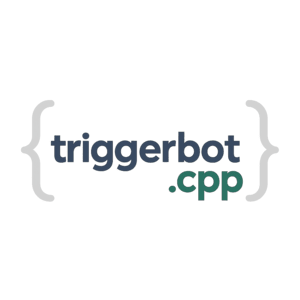
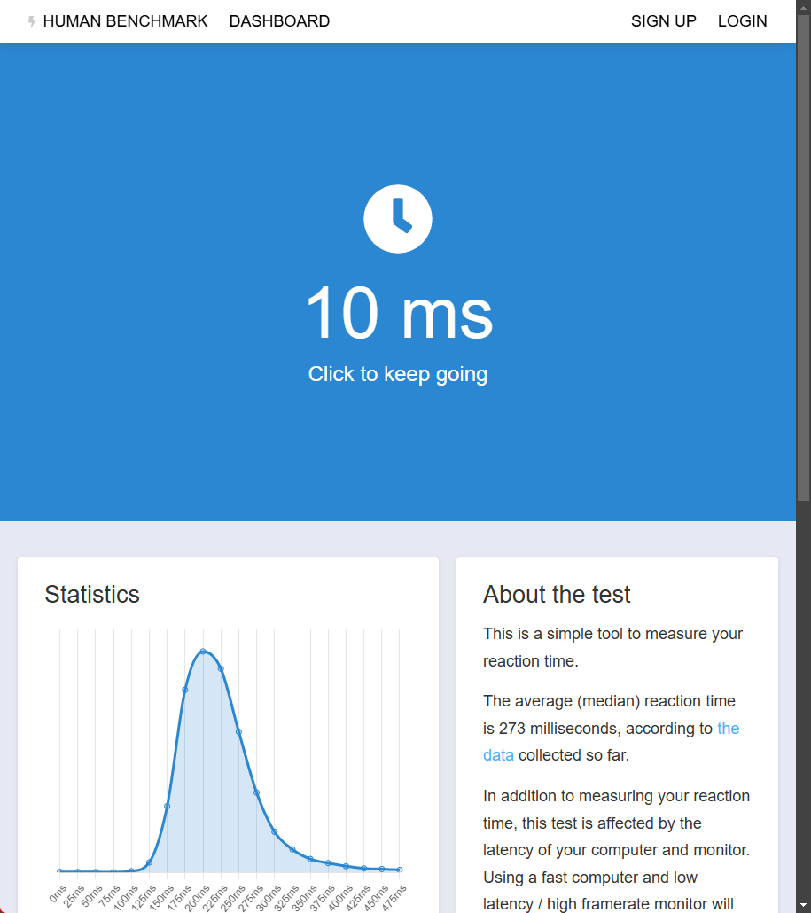

A high-performance, pixel-based triggerbot with universal detection capabilities.

## ⚡ Benchmark



**Lynx TriggerBot** achieves industry-leading reaction times of **10-15ms** on average! This is significantly faster than human reaction time (200-250ms) and outperforms most other solutions.

✅ Tested on [HumanBenchmark.com](https://humanbenchmark.com/) with consistent sub-15ms results!

## 🚀 Features

- 🖥️ **Desktop Duplication API** for ultra-fast screen capture with minimal overhead
- 🎯 **Universal pixel-change detection** that works with any application
- 🔄 **Adaptive sensitivity** that automatically adjusts to different scenarios
- ⚙️ **Customizable configuration** with easy-to-edit settings
- 🔍 **Reference frame reset logic** for improved accuracy
- 📊 **Performance tracking** with real-time reaction time display
- 🎮 **Natural click simulation** with randomized timing

## 🔧 Installation

1. Download the latest release from the [Releases](https://github.com/lynxapp/triggerbot/releases) page
2. Extract the ZIP file to a location of your choice
3. Run `TriggerBot.exe`

## 📝 Configuration Guide

The application creates a `config.txt` file on first launch with default settings. Here's what each setting does, explained in simple terms:

### Basic Settings

- **hold_mode** (Default: 1)
  - What it does: Controls how the trigger button works
  - Options: 1 = Hold down the button to activate, 0 = Press once to turn on/off
  - In simple terms: Choose whether you need to keep holding a key or just press it once to activate

- **hold_key** (Default: left_alt)
  - What it does: The key you press to activate the triggerbot
  - Common options: left_alt, left_shift, left_ctrl, etc.
  - In simple terms: This is the button you press to make the bot work

- **tap_time** (Default: 100)
  - What it does: How long the mouse click lasts in milliseconds
  - Range: 10-500 recommended (lower = faster clicks)
  - In simple terms: Controls how quick the mouse click is (100ms = 1/10th of a second)

### Detection Settings

- **scan_area_x** and **scan_area_y** (Default: 8)
  - What it does: Size of the detection area at screen center
  - Range: 2-32 recommended (higher values check more pixels but use more CPU)
  - In simple terms: How big of an area around your crosshair to check for enemies

- **change_sensitivity** (Default: 40.0)
  - What it does: How much a pixel must change to count as different
  - Range: 10-100 recommended (lower = more sensitive)
  - In simple terms: How noticeable a change needs to be to trigger a shot

- **pixel_change_threshold** (Default: 15)
  - What it does: How many pixels need to change before firing
  - Range: 1-30 recommended (lower = more sensitive)
  - In simple terms: How many "different" pixels needed before the bot clicks

### Advanced Features

- **reaction_time_min** and **reaction_time_max** (Default: 0)
  - What it does: Adds a random delay before firing (in milliseconds)
  - Range: 0-300 recommended (0 = no delay, instant firing)
  - In simple terms: Makes your reactions more human-like by adding a small delay

- **adaptive_mode** (Default: true)
  - What it does: Automatically adjusts sensitivity based on what's happening
  - Options: true = on, false = off
  - In simple terms: Makes the bot smarter by learning what works best

- **use_universal_mode** (Default: true)
  - What it does: Uses a detection method that works with almost any game
  - Options: true = on, false = off
  - In simple terms: Makes the bot compatible with more games

### Visuals and Debugging

- **debug_mode** (Default: true)
  - What it does: Shows technical information in the console window
  - Options: true = on, false = off
  - In simple terms: Displays helpful information about what the bot is doing

- **show_overlay** (Default: true)
  - What it does: Shows a visual box around your detection area
  - Options: true = on, false = off
  - In simple terms: Let's you see exactly what area the bot is checking

## 🔎 Tips for New Users

1. **Start with default settings** - The default configuration works well for most games
2. **Adjust scan area first** - If it's not working, try increasing scan_area_x and scan_area_y
3. **Lower thresholds for faster reactions** - Decrease pixel_change_threshold for more sensitivity
4. **Add reaction time for safety** - Set reaction_time_min and reaction_time_max to values like 50-150 to appear more human-like
5. **Use debug mode** - Keep debug_mode on to see what the bot is detecting

## 🛠️ Building from Source

### Prerequisites

- CMake 3.10 or higher
- C++17 compatible compiler
- DirectX SDK

### Build Steps

```bash
# Clone the repository
git clone https://github.com/lynxapp/triggerbot.git
cd triggerbot

# Create build directory
mkdir build
cd build

# Configure and build
cmake ..
cmake --build .
```

## 🧩 Architecture

The project is organized into several modules:

- `features`: Core functionality classes
- `graphics`: Screen capture using Desktop Duplication API
- `input`: Keyboard/mouse input handling
- `config`: Configuration management
- `performance`: Performance measurement utilities
- `ui`: Console UI helpers

## 📜 License

["Do Whatever The Fuck You Want"](LICENSE.md) - Sam Hoque

See the [LICENSE.md](LICENSE.md) file for the full terms.

## ⚠️ Disclaimer

This tool is provided for educational purposes only. The authors are not responsible for any misuse or violation of terms of service for any software or games.